LINK : https://github.com/kos00pas/ECE661.git

## Neural Network Workflow 
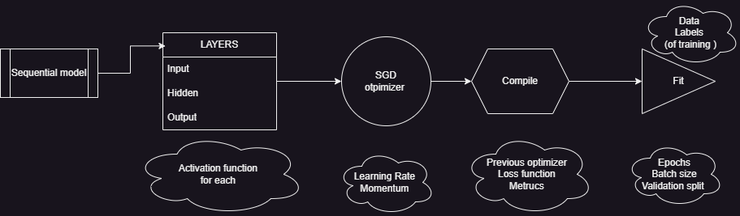
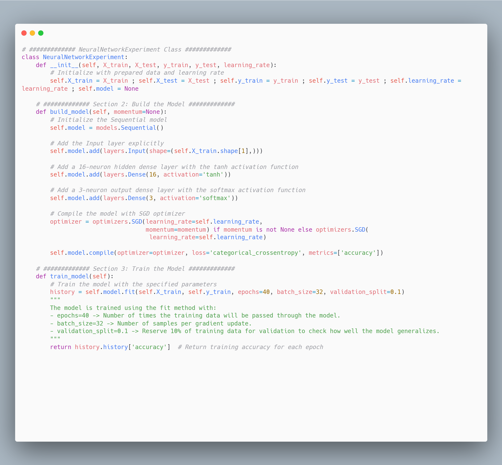

### 1.a 
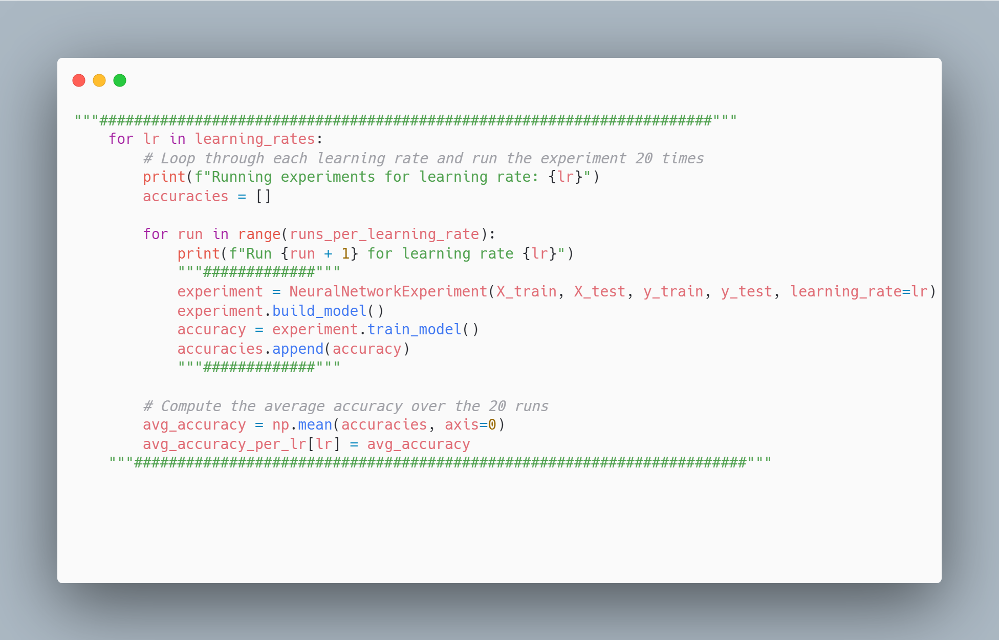
- a. **Best performing learning rate**: 
  - 0.5, as it achieves the best accuracy quickly with fewer epochs.
- b. **Learning rate explanation**:
  - Determines the step size for adjusting weights.
  - Higher rates lead to faster accuracy but risk overshooting and instability. 
  - Lower rates ensure stability but slower convergence. 
  - A rate of 0.2 avoids fluctuations while maintaining efficiency.
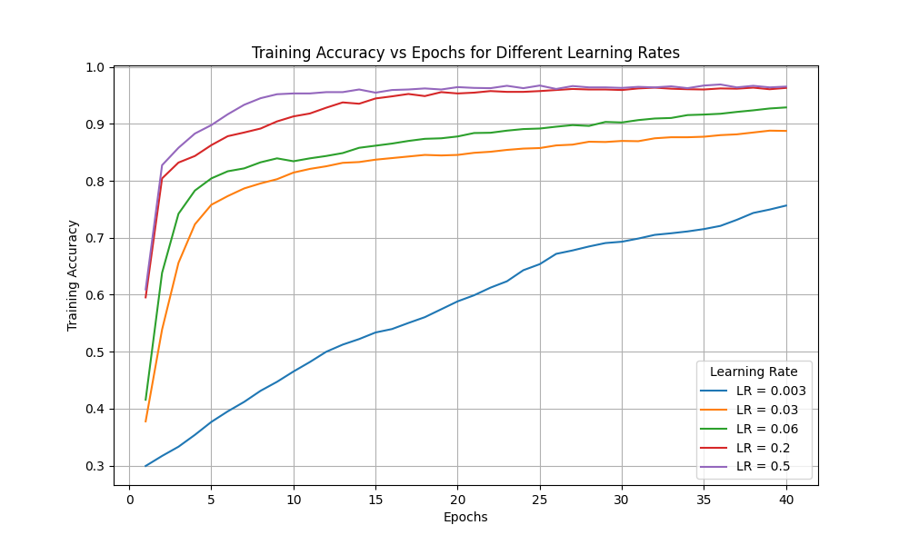
### 1.b
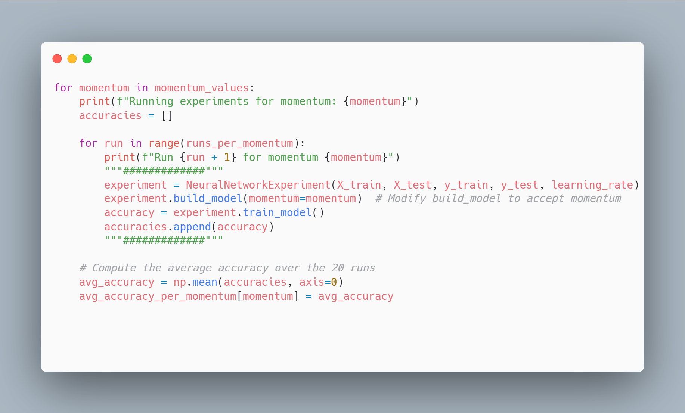
- a. **Best performing momentum:**
  - 0.9, as it reduces oscillations and accelerates convergence effectively(better than 0.99), leading to smoother updates.
- b. **What is momentum and how does it affect the training process?**:
  - Momentum is a technique used in Stochastic Gradient Descent (SGD) to accelerate the optimization process by incorporating a fraction of the previous gradients into the current update.
    - This helps smooth out fluctuations in the gradient updates and reduces oscillations, allowing the model to converge faster and more steadily toward the optimal solution.
  - Without momentum (momentum = 0), the optimization behaves like standard SGD, where the model updates weights based only on the current gradient.
    - This can introduce noise and cause oscillations, especially when using mini-batches, as the gradients are calculated from random subsets of data.
    - This randomness can make the optimization slower and unstable.
  - With momentum, a fraction of the previous weight updates is carried forward into the current update.
    - This allows the optimizer to "gain speed" in the right direction (where the gradients are more significant) while decelerating movement in less important directions.
    - Higher momentum values like 0.9 or 0.99 help smooth the trajectory of updates by averaging the gradient updates over time, which reduces oscillations and helps escape local minima.
- As a result, the model converges more quickly and smoothly.
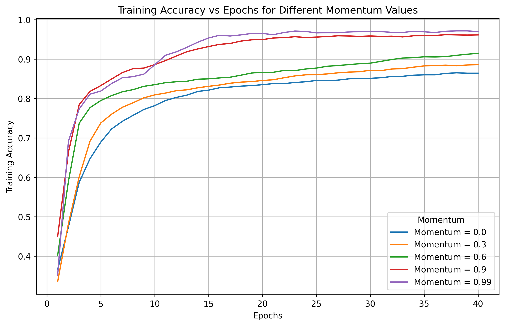

### 1.c 
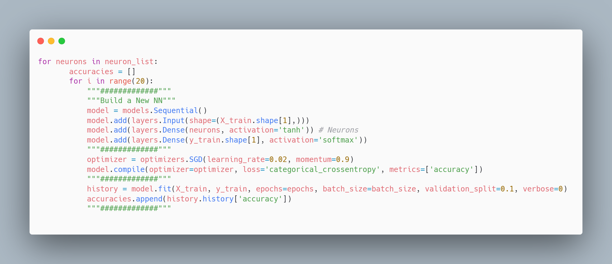
- a. **Best performing hidden layer neuron number**:
  - Based on the plot, 64 neurons perform the best as they achieve the highest accuracy after more epochs. 
  - However, 16 and 32 neurons perform well at lower epochs (around 10-15), reaching good accuracy quickly.
  - If the goal is to minimize training time, fewer neurons such as 16 or 32 might be more appropriate, while 64 neurons achieve the best long-term performance.
  - If the goal is to minimize the risk of overfitting, it would be better to choose fewer neurons, such as 16 or 32
- b. **Neurons explanation**: 
  - More neurons (e.g., 64) allow the model to capture more complex patterns, leading to higher accuracy, but may risk overfitting as the model becomes more complex.
  - Fewer neurons (e.g., 16 or 32) generalize better at lower epochs, reducing the risk of overfitting but may not capture as complex patterns as efficiently.
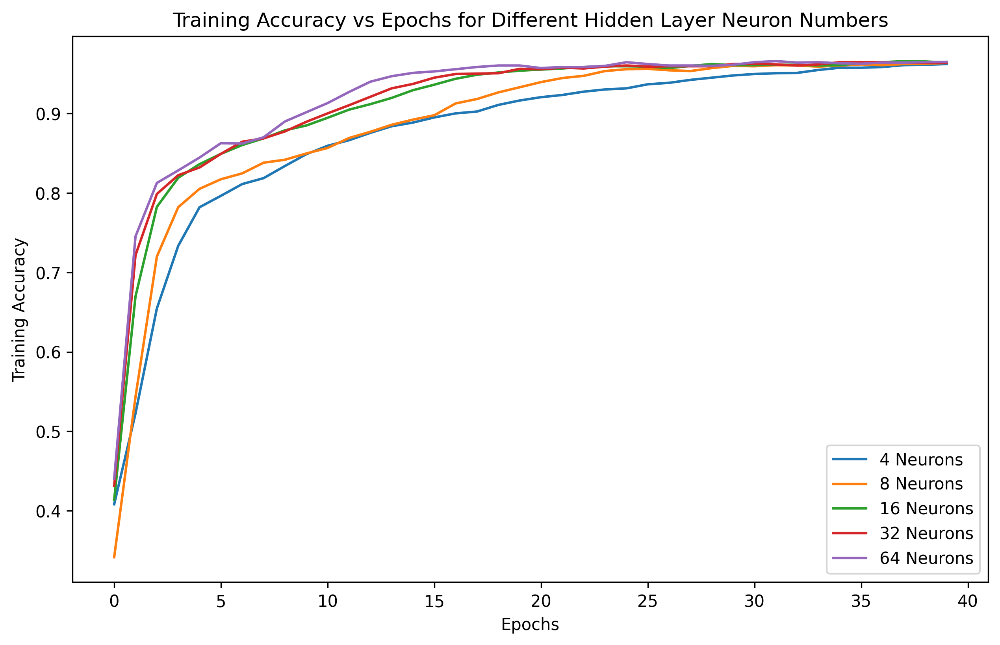

### 1.d 
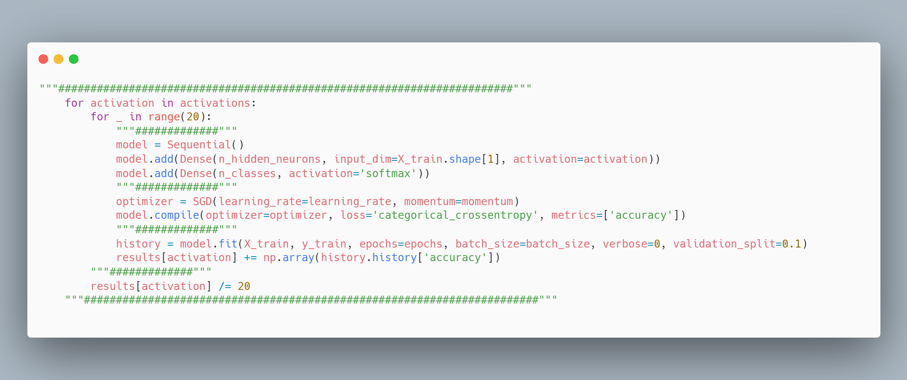
- a. **Best performing activation function**:
  - ReLU, as it is computationally cheaper and avoids the vanishing gradient problem while 'dying ReLU' is less harmful.
- b. **Activation function explanation**: 
  - Activation function: It introduces non-linearity to help the neural network learn complex patterns.
  - Tanh & Sigmoid: Both squash the input into a specific range (Tanh: -1 to 1, Sigmoid: 0 to 1), but can lead to vanishing gradients, slowing down learning.
  - ReLU: It outputs the input directly if positive, otherwise returns zero, avoiding the vanishing gradient problem but can suffer from "dying ReLU," where neurons stop updating.
  - All the above are Non-linear activation functions that can help the network learn complex patterns.
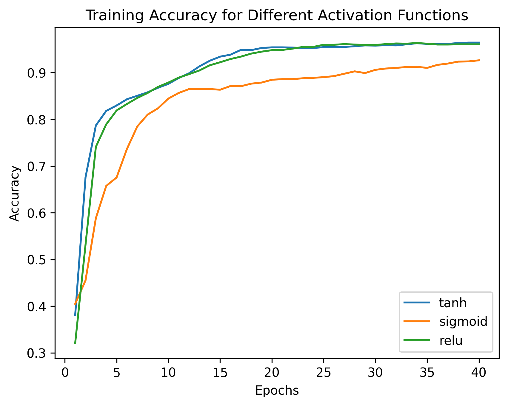

### 1.e 
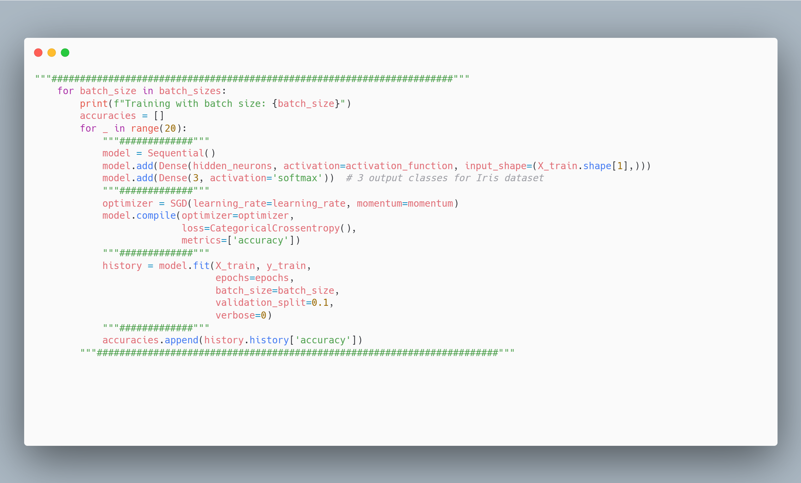
- a. **Best performing batch size**: 
  - Based on the performance at lower epochs, smaller batch sizes (like 8 or 16) perform better, as they allow for quicker adaptation.
  - However, larger batch sizes (like 64) eventually lead to more stable and higher accuracy, especially over longer training epochs.
  - If the goal is fast adaptation early in training, smaller batch sizes are better. 
  - However, if the goal is overall stability and generalization, batch size 64 would provide the best performance over the entire training process.

- b. **Batch size explanation**: 
  - Batch size determines how many samples are processed before weight updates.
  - Smaller sizes provide quicker adaptation but with more instability. Larger sizes ensure stable and gradual updates.
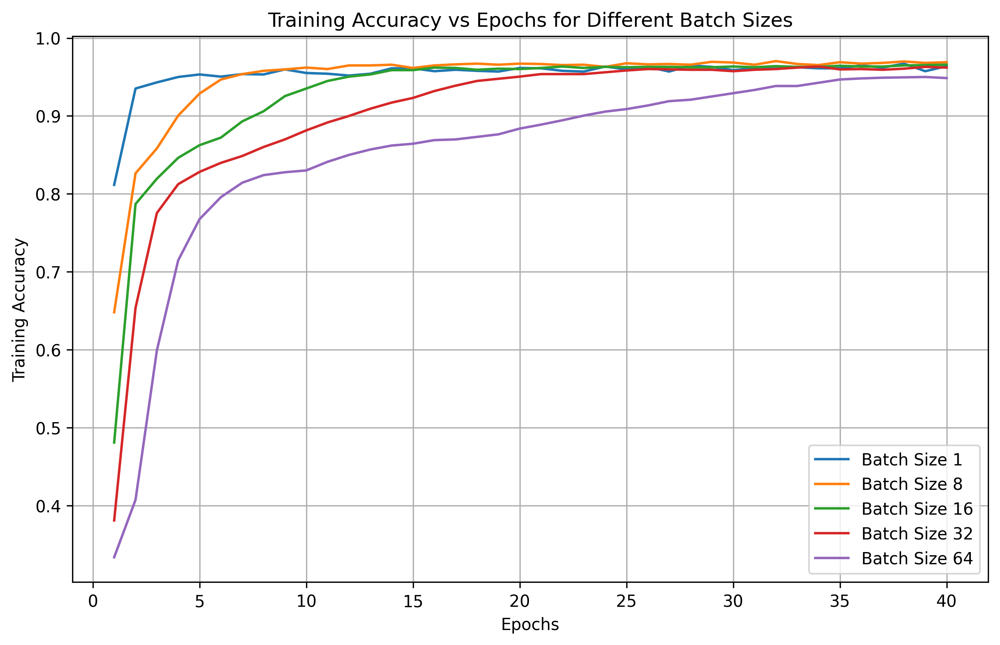

### 2.
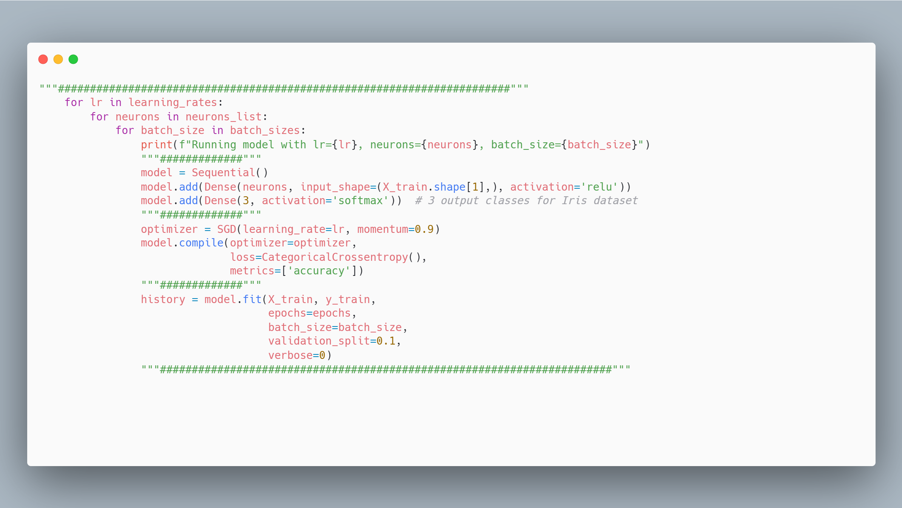
 - activation function : ReLU
   - Avoid vanishing gradient problem in better than avoid dying relu
   - Computationally simpler , promotes sparsity 

 - Momentum : 0.9
    - A good balance between smoothing the updates and reducing oscillations, while avoiding excessive inertia that might come with higher momentum values like 0.99   

 - Learning rate  : 0.2
    - Less instability risks associated with the higher rate of 0.5.

 - hidden layer neurons: 32
   - More neurons allow the model to capture complex patterns in the data.
   - Select 32 over 64 to reduce the risk of Overfitting.

 - batch size:  64
    - table and gradual updates 
    - Larger batch sizes tend to generalize

#### Tricky part : 
- Learning Rate: 0.2 instead 0.5 
  - stability , less  overshooting  risk 
- Neurons: 32  instead 64 -
  - more patters less overfitting risk 
- Batch size: 64  instead 32 -
  - stable and gradual updates

To be sure about the [Learning Rate, Neurons, Batch size] I prepare the following experiment:
* Keep constant ReLu, Momentum and changing the above (total 8 combinations). 
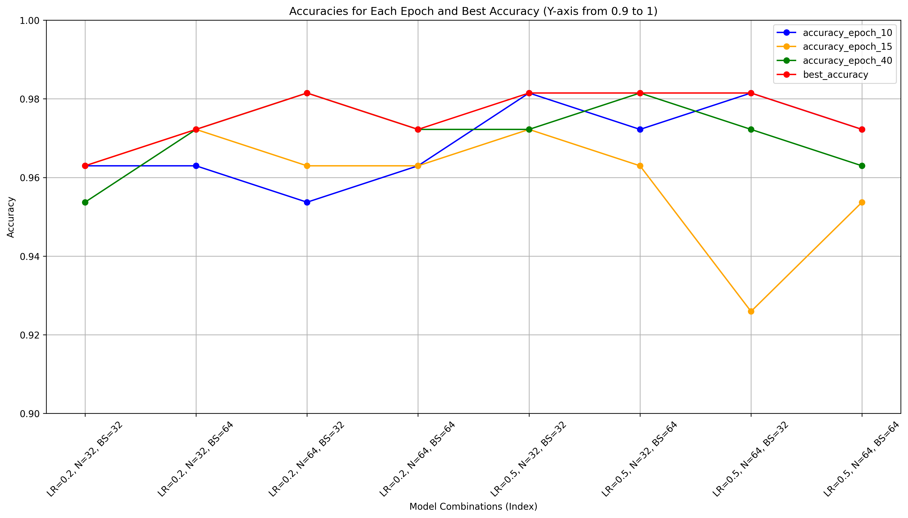
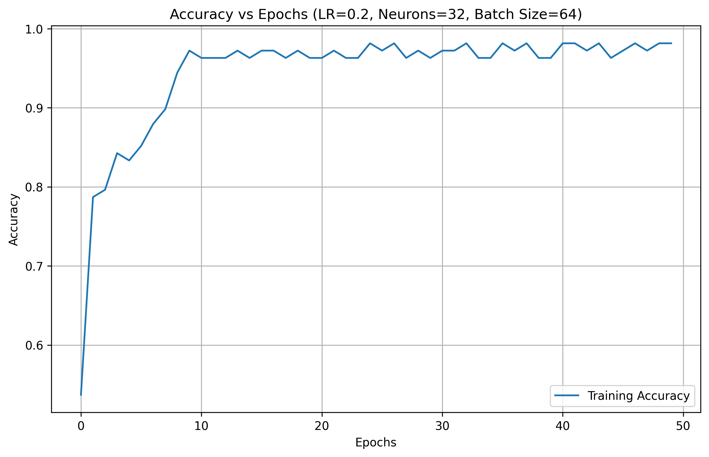